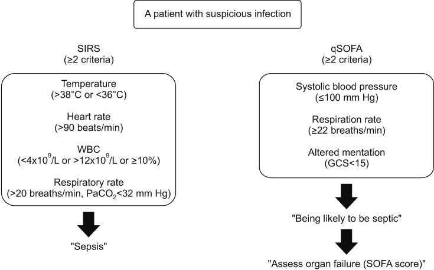

# Systemic Inflammatory Response Syndrome Early Detection

## Introduction

Sepsis is a life-threatening inflammatory disorder and the immune system's response to infection.
Sepsis is a major cause of death from infection and represents a substantial 
healthcare burden, accounting for 6.2% of total hospital costs in the United 
States 20111. The estimated annual incidence of sepsis in the United States 
was 751,000 cases (3 cases/1,000 population) and the estimated number of deaths 
was 215,0002. Sepsis is a complication of severe infection characterized by a 
systemic inflammatory response. Mortality rates from sepsis range between 25% 
to 30% for severe sepsis and 40% to 70% for septic shock. 

The most common sites of infection are the respiratory, genitourinary, and 
gastrointestinal systems, as well as the skin and soft tissue. Fever is often 
the first manifestation of sepsis, with pneumonia being the most common presentation 
leading to sepsis. Early goal-directed therapy completed within the first six hours 
of sepsis recognition significantly decreases in-hospital mortality. 

In accordance with "Early Recognition and Management of Sepsis in Adults: The First Six Hours"
## Definition of Diseases
### Systemic inflammatory response syndrome (SIRS)
- 2 or more are met:
    - Body temperature > 38.5°C or < 35.0°C
    - Heart rate > 90 beats per minute
    - Respiratory rate > 20 breaths per minute or arterial CO2 tension < 32 mm Hg or need for mechanical ventilation
    - White blood cell count > 12,000/mm3 or < 4,000/mm3 or immature forms > 10%
    
### Sepsis
- Systemic inflammatory response syndrome and documented infection
### Severe sepsis
- Sepsis and at least one sign of organ hypoperfusion or organ dysfunction:
    - Areas of mottled skin 
    - Capillary refilling time ≥ 3 s 
    - Urinary output < 0.5 mL/kg for at least 1 h or renal replacement therapy 
    - Lactates > 2 mmol/L 
    - Abrupt change in mental status or abnormal electroencephalogram 
    - Platelet counts < 100,000/mL or disseminated intravascular coagulation 
    - Acute lung injury—acute respiratory distress syndrome 
    - Cardiac dysfunction (echocardiography)
### Septic shock
- Severe sepsis and one of:
    - Systemic mean blood pressure of < 60 mm Hg (< 80 mm Hg if previous hypertension) after 20–30 mL/kg starch or 40–60 mL/kg serum saline, or pulmonary capillary wedge pressure between 12 and 20 mm Hg
    - Need for dopamine > 5 μg/kg per min or norepinephrine or epinephrine < 0.25 μg/kg per min to maintain mean blood pressure above 60 mm Hg (> 80 mm Hg if previous hypertension)
### Refractory septic shock
- Need for dopamine > 15 μg/kg per min or norepinephrine or epinephrine > 0.25 μg/kg per min to maintain mean blood pressure above 60 mm Hg (> 80 mm Hg if previous hypertension)

Patient with suspicious infection
> Definitions for SIRS and qSOFA. SIRS: systemic inflammatory response syndrome; qSOFA: Sequential Organ Failure Assessment; WBC: white blood cell.

## Project Overview

Goal: An operational supervised binary classification machine learning model to predict patients with Systemic inflammatory response syndrome (SIRS) 
for early identification of Sepsis powered by the Red Hat Portfolio, which consists of:

|Function|Solution|
|-|-|
|AI/ML Operations|<Red Hat Products>|
|MLOps|aicoe-ci, thoth-station|
|AI/ML Development|Open Data Hub project|
|Registry|Quay|
|Pipeline|Tekton|
|Data Storage|Red Hat OpenShift Container Storage|
|Container Platform|Red Hat OpenShift|
|GPU|NVIDIA|
|Infrastructure|HPE EL8000|

Dataset comes from Kaggle (https://www.kaggle.com/maxskoryk/datasepsis) 
- Total size = 11.4MB
- Total patient entries = 36,302
- Total attributes = 41
- Combined data in .CSV format containing Vitals, Labs and Demographics
- Labeled data column 41 "isSepsis" with 0=False 1=True
- Raw data contains both null and non-null values 
- Data types are numeric (float64 and int64)

# Project Lifecycle
## Development
> Data Engineer
1. Data identification 
1. Data exploration / engineering in Jupyter Notebooks
   
> Data Scientists
1. Data transformation
1. Model development in Jupyter Notebooks
1. Model productization in Python

## Operations   
> Application Developer
1. Model serving using ?
1. Model observations using ?
1. Model update using ?

## MLOps
1. aicoe-ci
1. thoth-station
1. tekton

# Dataset

Based on the data:

Vitals signs
|Column|Definition|Keep|Drop|Note|
|-|-|-|-|-|
|HR|Heart Rate normal adult 60 - 100 beats per minute (bpm)||||
|O2Sat|Oxygen saturation normal adult 97% - 100% (%)||||
|Temp|Temperature normal 97.8°F/36.5°C - 99°F/37.2°C (°C)||||
|SBP|Systolic Blood Pressure normal < 120 mmHg (mm Hg)||||
|DBP|beclomethasone dipropionate normal < 80 mmHg (mm Hg)||||
|MAP|Mean Arterial Pressure (mm Hg)||||
|Resp|Respiration rate  12<normal<20 breaths / minute (bpm)||||
|EtCO2|End-tidal CO2 maximum concentration of CO2 at exhalation normal 35 - 45 mmHg ||||

Laboratory values
|Column|Definition|Keep|Drop|Note|
|-|-|-|-|-|
|BaseExcess|strong acid to restore pH (mmoI/L)||||
|Magnesium|symptoms such as weakness, irritability, cardiac arrhythmia, nausea, and/or diarrhea (mmoI/L)||||
|Glucose|blood sugar test (indicates diagnose diabetes, pre-diabetes and gestational diabetes) (mg/dL)||||
|Alkalinephos|Alkaline phosphatase (indicates enzyme activity) (IU/L)||||
|pH|0:14 = acidic = lower pH; alkaline = higher||||
|Chloride|an electrolyte to balance fluid in cells normal 96-103 ml (indicates blood pressure/pH) (mmoI/L)||||
|Lactate|high levels indicate lack of oxygen (hypoxia) or other conditions (indicates sepsis) (mg/dL)||||
|# Respiratory|||||
|HCO3|Bicarbonate, carbon dioxide in blood (indicates metabolism / resp) (mmoI/L)||||
|FiO2|# % of concentration of oxygen inhaled (indicates resp) (%)||x|missing entries|
|PaCO2|partial pressure of carbon dioxide measured in blood (indicates resp) (mm Hg)|||missing entries|
|SaO2|normal 95-100% oxygen saturation bound to hemoglobin (indicates resp) (%)|||lack indication|
|# liver|||||
|AST|aspartate aminotransferase (indicates liver) (IU/L)||||
|Bilirubin_direct|conjugated water soluble (indicates liver) (mg/dL)||x|missing entries|
|Bilirubin_total|normal 0.1:1.2 mg/dL (indicates liver) (mg/dL)||||
|# kidneys|||||
|BUN|blood urea nitrogen, nitrogen in the blood (indicates kidneys) (mg/dL)||||
|Creatinine|metabolic panel (indicates kidneys) (mg/dL)||||
|Calcium|indicates range of conditions bones, heart, nerves, kidneys, and teeth (mg/dL)||||
|Phosphate|related to calcium (indicates kidney or diabetes)  (mg/dL)||||
|Potassium|electrolyte or metabolism (affected by blood pressure, kidneys, etc.)  (mmoI/L)||||
|# Heart|||||
|Troponin I|cardiac specific Trenonin I and T (indicates injury to heart muscle)||||
|# Blood|||||
|Hct|Hematocrit (indicates portion of blood from Red Blood Cell count) (%)||||
|Hgb|Hemoglobin apart of Complete Blood Count (CBC) (indicates blood cell count) (g/dL)||||
|WBC|White Blood Cell Count (indicates infection, inflammation or disease) (count10^3/µL)||||
|PTT|Partial Thromboplastin Time (indicates bleeding or blood clot) (seconds)||||
|Fibrinogen|coagulation factor I (indicates bleeding or blood clot or cardiovascular disease) (mg/dL)||||
|Platelets|indicates bleeding disorder, a bone marrow disease, or other underlying condition ((count10^3/µL))||||

Demographics
|Column|Definition|Keep|Drop|Note|
|-|-|-|-|-|
|Age|Years (100 for patients 90 or above)||||
|Gender|Female = 0, Male = 1||||
|Unit 1|identifier for ICU unit (MICU)||||
|Unit 2|identifier for ICU unit (SICU)||||
|HospAdmTime|Hours between hospital admit and ICU admit||||
|ICULOS|ICU length of stay in hours (hours since ICU admit)||||

# References
1. https://www.ncbi.nlm.nih.gov/pmc/articles/PMC6304323/ 
1. https://www.aafp.org/afp/2013/0701/p44.html   
1. https://www.kaggle.com/maxskoryk/datasepsis
1. https://www.nursingcenter.com/ncblog/march-2017/elevated-lactate-%E2%80%93-not-just-a-marker-for-sepsis-an

