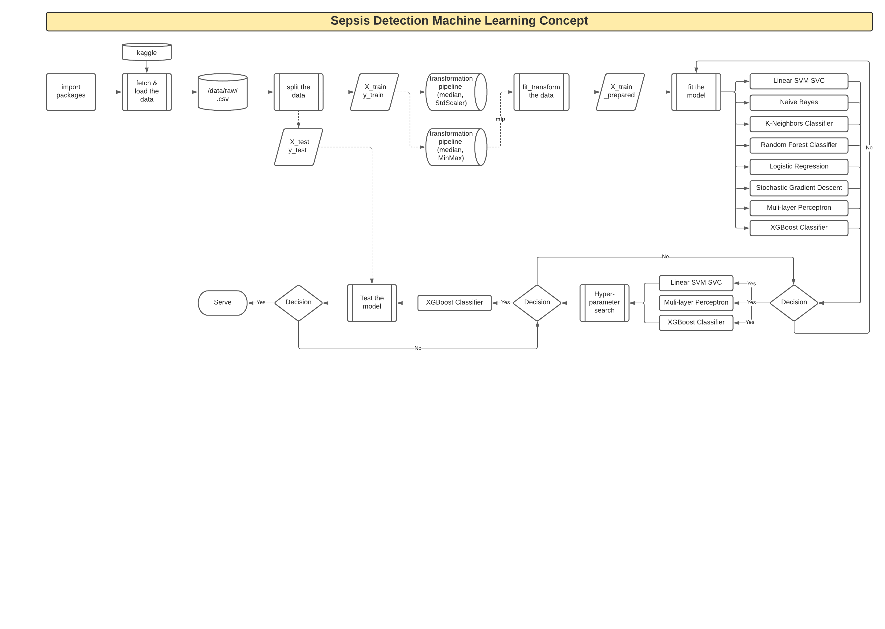

# Systemic Inflammatory Response Syndrome Early Detection

## Project Overview

Goal: An online containerized machine learning microservice to predict patients likely
to become septic based on vital signs and laboratory values powered by 
the Red Hat Portfolio.



# Machine Learning Checklist
> From O'REILLY Hands-on Machine Learning with Scikit-Learn, Keras & TensorFlow 2nd Edition

## Frame the problem
1. Define the objective: 
   1. early prediction of Sepsis based on patient Vital Signs and Laboratory Values
1. How will the solution be used: 
   1. Collected patient vitals and labs fetched on a recurring time interval and passed through the data transformation pipeline and model for Sepsis prediction
1. What are the current solutions/workarounds: 
   1. provider manually enters values in a Sepsis application
1. How should you frame this problem: 
   1. supervised, online, classification
1. How should performance be measured: 
    1. f1_score - measure provides a way to combine both precision and recall into a single measure that captures both properties
    1. recall - calculated as the number of true positives divided by the total number of true positives and false negatives; good for unbalanced data
    1. precision - quantifies the number of correct positive predictions made; good for unbalanced data
1. What is the minimum performance needed to attain the objective for a prototype: 
   1. 60%
1. What are the comparable problems? can you resuse experience or tools? 
   1. Severe Septic Shock, Refractory Septic Shock, Hypertension, etc.
1. Is human expertise available? 
   1. yes
1. How would you solve the problem manually? 
   1. heuristics
1. List the assumptions made so far:
    1. the data is synthetic used to train the model
1. Verify the assumptions: 
    1. from the data "ICULOS" is the strongest indicator predicting Sepsis, but when removed from the data negatively impacts the models accuracy.
  
## Get the data
> python functions

1. List the data needed and how much:
    1. vital signs
    1. laboratory values
    1. minimum >50k records
1. Where to get the data: 
   1. [Kaggle](https://www.kaggle.com/maxskoryk/datasepsis)
1. How much space will it take: 
   1. 11.4MB
1. Check legal obligations: 
    1. [Attribution 4.0 International (CC BY 4.0)](https://creativecommons.org/licenses/by/4.0/)
    1. Free to: 
       1. Share — copy and redistribute the material in any medium or format 
       1. Adapt — remix, transform, and build upon the material for any purpose, even commercially.
1. Get access authorizations.
1. Create workspace with enough storage: 
   1. Open Data Hub on Red Hat OpenShift
1. Get the data:
   1. submodules/fetch_data.py
1. Convert the data to a format to manipulate without changing the data: 
   1. submodules/load_data.py
1. Ensure sensitive data is deleted or protected (e.g. anonymized).
1. Check the size and type of data (time series, sample, geographical):
   1. Total size = 11.4MB
   1. Total patient entries = 36,302
   1. Total attributes = 41 
   1. Combined data in .CSV format containing Vitals, Labs and Demographics 
   1. Labeled data column 41 "isSepsis" with 0=False 1=True
   1. Numeric (float64 and int64)
   1. Includes null/NaN

## Explore the data to gain insights
> data-engineering.ipynb

1. Create a copy of the data for exploration
1. Create a Jupyter Notebook to keep record of exploration
1. Study each attribute:
    1. name
    1. data type (numeric, categorical, bounded/un, text, structured, etc.)
    1. % missing values
    1. Noisiness (stochastic, outliers, rounding errors, etc.)
    1. Usefulness for the task
    1. Type of distribution (Gaussian, uniform, logarithmic, etc.)
1. For supervised learning tasks, identify the target attributes
1. Visualize the data
1. Study the correlations between attributes
1. Study how to manually solve the problem
1. Identify promising transformations
1. Identify extra data that would be useful (go back to Get the Data.)
1. Document

## Prepare the data to expose the underlying data patterns for Machine Learning
> data-scientists.ipynb
1. Work on copies of the data
   1. see data/ subdirectory
1. Write functions for all data transformations.
1. Data cleaning:
    1. fix or remove outliers
    1. fill in missing values
    1. drop rows or columns
1. Feature selection:
    1. drop attributes that provide no useful information for the task
1. Feature engineering:
    1. Discretize continuous features
    1. Decompose features
    1. Add transformations
    1. Aggregate features

## Explore different models and shortlist the best ones
> data-scientists.ipynb
1. Sample smaller training sets (if afforable)
1. Train many models from different categories 
    1. Linear Support Vector Machine "SVM" Support Vector Classifier "SVC"
    1. Naive Bayes
    1. K-Neighbors Classifier 
    1. Random Forest Classifier 
    1. Logistic Regression
    1. Stochastic Gradient Descent "SGD" Classifier
    1. Neural Network Multi-Layer Perceptron Classifier 
    1. XGBoost Classifier
1. Measure and compare performance
    1. Cross Validations with f1_scoring
1. Analyze the most significant variables for each algorithm
1. Analyse the types of errors the models make 
    1. would a human have avoided them?
1. Perform a round of feature engineering and selection
1. Perform 1-2 quick iterations
1. Shortlist the top 3-5 most promising models that make different errors

## Fine-tune the models and select or combine the best solution
> *_model.ipynb

1. Want as much data as possible
1. Fine-tune hyperparameters using cross-validation
1. Try Ensemble methods combining models
1. Measure final model on Test set to estimate the error

## Present the solution
1. Document what you have done
1. Create a presentation
1. Explain why the solution achieves the business objective
1. Highlight interesting points
    1. what worked?
    1. what didn't?
    1. assumptions
    1. limitations

## Launch, monitor and maintain the system
1. Get model ready for production
1. Write monitoring code to check at regular intervals and trigger alerts when it drops
1. Beware: 
    1. slow degradation as data evolves
    1. monitor input quality as well as output
1. Retrain models on fresh data regularly (automate it!)

```angular2html
.
├── README.md
├── data
│   ├── in                                                  # simulate new patient(s) vitals, labs, etc. data
│   │   └── new_data.csv                              # sample new data  
│   ├── out                                                 # simulate predictions from input data    
│   │   └── new_data_results.csv                      # sample new data predictions  
│   ├── raw                                                 # raw data for exploration to training
│   │   ├── archive.gz                    
│   │   ├── archive.zip
│   │   └── dataSepsis.csv
│   └── transform                                           # data transformation pipelines serialized to disk 
│       ├── pipeline.pkl
│       └── pipeline_minmax.pkl
├── images                                                        # images used in the notebooks for illustration  
│   ├── SIRSvsqSOFA.jpg
│   ├── SepsisDetection.png
│   ├── confusion_matrix.png
│   └── scikitlearn-choose-right-estimator.png
├── main.py                                                       # main prediction python script
├── models                                                        # serializes model files from experiment to final downselection
│   ├── experiment                                          # serialized from data-science notebook                   
│   │   ├── gnb_model.pkl
│   │   ├── knn_model.pkl
│   │   ├── log_model.pkl
│   │   ├── mlp_model.pkl
│   │   ├── rfc_model.pkl
│   │   ├── sgd_model.pkl
│   │   ├── svc_model.pkl
│   │   └── xgbc_model.pkl
│   ├── final                                               # production-ready models
│   │   ├── mlp_model.pkl
│   │   └── xgbc_model.pkl
│   └── tune                                                # hyperparameter tuned models
│       ├── mlp_model.pkl
│       └── xgbc_model.pkl
├── notebooks
│   ├── README.md
│   ├── data-engineering.ipynb                              # exploring data
│   ├── data-science.ipynb                                  # feature engineering and model exploring
│   ├── mlp-model.ipynb                                     # downselected model for production
│   ├── rfc-model.ipynb                                     # downselected model for production
│   └── xgbc-model.ipynb                                    # downselected model for production
├── reports                                                       # saved figures for reference
│   └── figures
│       ├── experiment
│       │   ├── gnb_cm.png
│       │   ├── gnb_prc.png
│       │   ├── knn_cm.png
│       │   ├── knn_prc.png
│       │   ├── log_cm.png
│       │   ├── log_prc.png
│       │   ├── mlp_cm.png
│       │   ├── mlp_prc.png
│       │   ├── rfc_cm.png
│       │   ├── rfc_prc.png
│       │   ├── sgd_cm.png
│       │   ├── sgd_prc.png
│       │   ├── svc_cm.png
│       │   ├── svc_prc.png
│       │   ├── xgbc_cm.png
│       │   └── xgbc_prc.png
│       ├── final
│       │   ├── mlp_cm.png
│       │   ├── mlp_prc.png
│       │   ├── rfc_cm.png
│       │   ├── rfc_prc.png
│       │   ├── xgbc_cm.png
│       │   └── xgbc_prc.png
│       └── tune
│           ├── mlp_cm.png
│           ├── rfc_cm.png
│           └── xgbc_cm.png
├── requirements.txt                                                  # required packages
├── scratch                                                           # scratch/to-delete folder
│   ├── model-performance-assessment.ipynb
│   ├── scratch-pad
│   ├── train_svc.py
│   ├── train_svc_grid.py
│   └── train_svc_rand.py
├── serving                                                             # model serving work
│   ├── README.md
│   └── fn
│       ├── func.py
│       ├── func.yaml
│       ├── requirements.txt
│       └── test_func.py
└── submodules                                                          # reusuable python functions/methods
    ├── __init__.py
    ├── __pycache__
    │   ├── __init__.cpython-39.pyc
    │   ├── config.cpython-39.pyc
    │   ├── fetch.cpython-39.pyc
    │   ├── fetch_data.cpython-39.pyc
    │   └── load_data.cpython-39.pyc
    ├── config.py 
    ├── fetch_data.py
    └── load_data.py
```